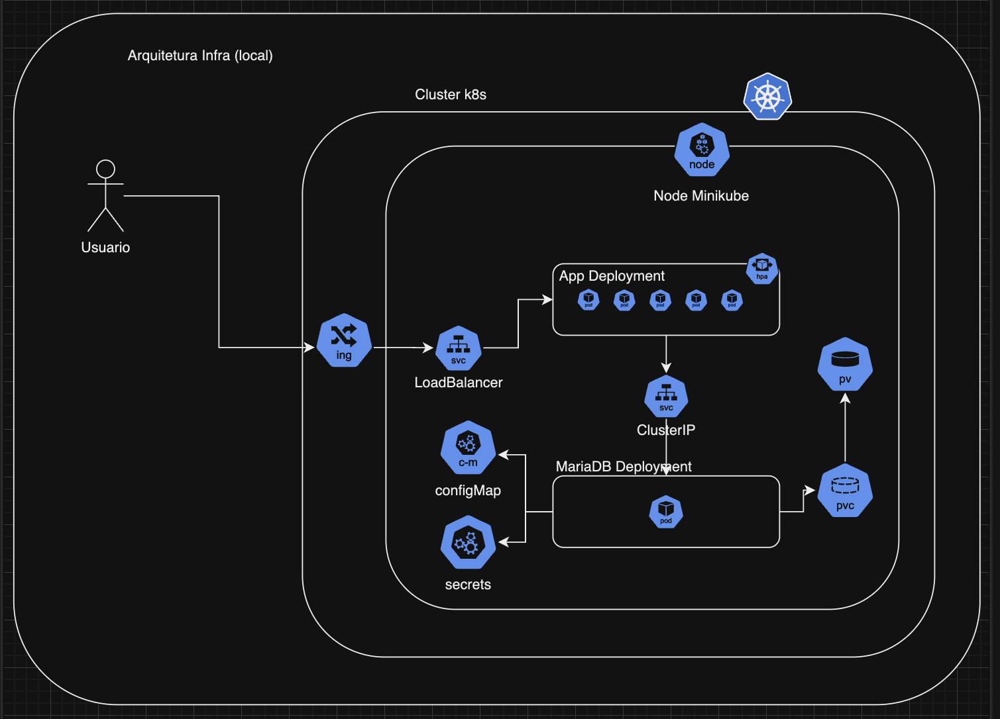

# Lanchonete Filura

Projeto para lanchonete fictícia para simular um sistema de autoatendimento - Pós Tech FIAP - Software Architecture

# Documentação

Documenteção principal do projeto: https://rightful-jupiter-cbe.notion.site/Fase-1-96dd6270102b49ddb963bcee5758acba?pvs=25

# Getting Started
---------------- K8S ----------------------

Para rodar o projeto com o K8S, o primeiro pré requisito é ter baixado o minikube https://minikube.sigs.k8s.io/docs/handbook/accessing/

rode o comando minikube start e aguarde ele iniciar

Com o terminal na sua IDE, já na pasta raiz do projeto, navege até a pasta com os arquivos do K8S:

cd infra/k8s/

na sequencia rode os dois comandos para executar os arquivos:

kubectl apply -f app/.
kubectl apply -f db/.

para expor o loadBalancer e acessar via localhost, rode o comando (ele travará seu terminal):

minikube tunnel

-------- DOCKER COMPOSE --------------------

Pre-requisito: Ter o docker instalado na mácina e estar com o serviço em execução - https://www.docker.com/get-started/

* Para rodar o projeto, utilizar o arquivo compose.yaml localizado na pasta raiz do projeto:

Com seu terminal, navegue até a raiz desse projeto e rode o comando:

docker-compose up

# Desenho da arquitetura

https://rightful-jupiter-cbe.notion.site/Fase-2-7de6bcb43ab6425e83932ba0e27dc41d?pvs=4

# Postman

Collection para requisicoes

https://rightful-jupiter-cbe.notion.site/Fase-2-7de6bcb43ab6425e83932ba0e27dc41d?pvs=4

# Swagger

Para testar a api localmente, utilize o caminho: http://localhost:8080/swagger-ui/index.html

Lembre-se:

Para cadastrar um produto, precisa cadastrar primeiro as categorias. Para as categorias serão aceitas as seguintes descrições:

"lanche"
"acompanhamento"
"bebida"

Para cadastrar um pedido, necessário cadastrar os produtos primeiro para vincula-los ao pedido. Identificação do cliente no pedido é opcional

### Reference Documentation
For further reference, please consider the following sections:

* [Official Gradle documentation](https://docs.gradle.org)
* [Spring Boot Gradle Plugin Reference Guide](https://docs.spring.io/spring-boot/docs/3.1.5/gradle-plugin/reference/html/)
* [Create an OCI image](https://docs.spring.io/spring-boot/docs/3.1.5/gradle-plugin/reference/html/#build-image)
* [Spring Boot DevTools](https://docs.spring.io/spring-boot/docs/3.1.5/reference/htmlsingle/index.html#using.devtools)
* [Docker Compose Support](https://docs.spring.io/spring-boot/docs/3.1.5/reference/htmlsingle/index.html#features.docker-compose)

### Additional Links
These additional references should also help you:

* [Gradle Build Scans – insights for your project's build](https://scans.gradle.com#gradle)

### Docker Compose support
This project contains a Docker Compose file named `compose.yaml`.
In this file, the following services have been defined:

* mariadb: [`mariadb:latest`](https://hub.docker.com/_/mariadb)

Please review the tags of the used images and set them to the same as you're running in production.

